## 0. Preparativos

Creo el repositorio público en Github y lo clono en mi equipo.

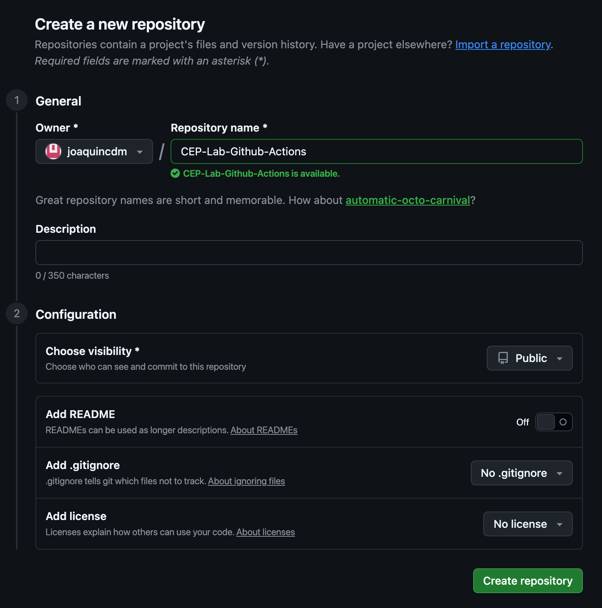

Añado el código fuente del proyecto (las 3 carpetas del proyecto hangman) 

Este proyecto cuenta con tres flujos de trabajo (workflows) de GitHub Actions configurados para automatizar la integración, entrega y pruebas del proyecto.

## 1. Workflow CI para el proyecto de frontend

En la clase hemos estado trabajando con el proyecto de la [API](./code/hangman-api/), pero en este ejercicio trabajarás sobre el proyecto de [frontend](./code/hangman-front/).

Debes crear un nuevo workflow que se dispare cuando haya cambios en el proyecto `hangman-front` y exista una nueva pull request (deben darse las dos condiciones a la vez). El workflow ejecutará las siguientes operaciones:

- Build del proyecto
- Ejecución de los test unitarios

> Nota: muy parecido a la primera demo, pero en este caso sobre el proyecto del frontend

Creo el archivo `.github/workflows/frontend-ci.yml` y lo añado al repositorio. Este workflow se encarga de asegurar la calidad y estabilidad del frontend ejecutando el proceso de build y las pruebas unitarias.

Este es el código del archivo frontend-ci.yml:

```yaml
name: Frontend CI

on:
  pull_request:
    branches:
      - "main"
    paths:
      - "hangman-front/**"

jobs:
  build-and-test:
    runs-on: ubuntu-latest

    steps:
      - name: Checkout repository
        uses: actions/checkout@v4

      - name: Set up Node.js
        uses: actions/setup-node@v4
        with:
          node-version: 18
          cache: 'npm'
          cache-dependency-path: 'hangman-front/package-lock.json'

      - name: Install Frontend dependencies
        working-directory: hangman-front
        run: npm ci

      - name: Run Build
        working-directory: hangman-front
        run: npm run build

      - name: Run Unit Tests
        working-directory: hangman-front
        run: npm run test
```


- **Trigger (Eventos disparadores)**:
  - Se ejecuta ante eventos de `pull_request` pero **únicamente** cuando hay cambios dentro de la carpeta `hangman-front/` (usando filtros de ruta `hangman-front/**`).
- **Pasos del Workflow**:
  1. **Checkout**: Descarga el código del repositorio usando `actions/checkout@v6`.
  2. **Setup Node.js**: Configura Node.js (v18) y habilita la caché para `npm` con `actions/setup-node@v6`.
  3. **Install Dependencies**: Ejecuta `npm ci` en el directorio de frontend para instalar de forma limpia las dependencias del proyecto.
  4. **Run Build**: Compila el proyecto ejecutando `npm run build` (que incluye el type-checking con TypeScript y la compilación de producción con Webpack).
  5. **Run Unit Tests**: Ejecuta los tests unitarios configurados mediante `npm run test` (utilizando Jest).
- **Actions usadas**:
  - `actions/checkout@v6`
  - `actions/setup-node@v6`

### Comprobación del workflow

Para comprobar que el workflow funciona como se espera, hago un cambio en el archivo `hangman-front/src/index.html` y lo subo a la rama `feature/frontend-ci`. Como he indicado que el workflow se dispare ante eventos de `pull_request` y cambios dentro de la carpeta `hangman-front/`, el workflow se ejecutará automáticamente.

Una vez subidos los cambios voy a Github y compruebo que el workflow se ha ejecutado correctamente.
Creo una nueva rama para realizar cambios en el proyecto y comprobar que el workflow se ejecuta correctamente.

```bash
git checkout -b feature/frontend-ci
```
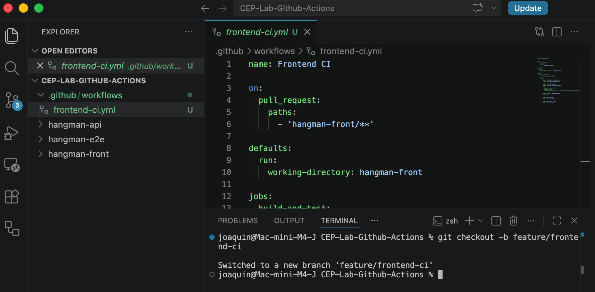

Voy a Github y miro la pestaña "Pull Request" para ver los resultados.

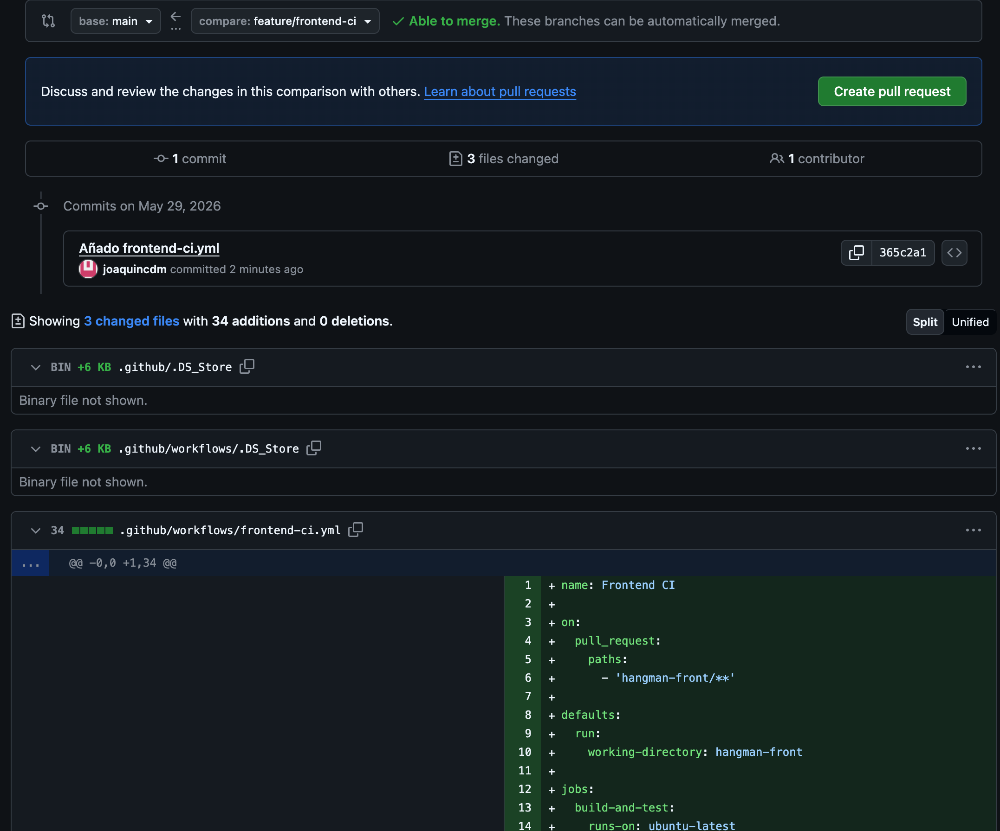

No se ha ejecutado ninguna acción porque realmente no se ha modificado ningún archivo de la carpeta `hangman-front/`.

Así que ahora voy a modificar el archivo index.html que está dentro de la carpeta `hangman-front/src/` para que se ejecute el workflow.

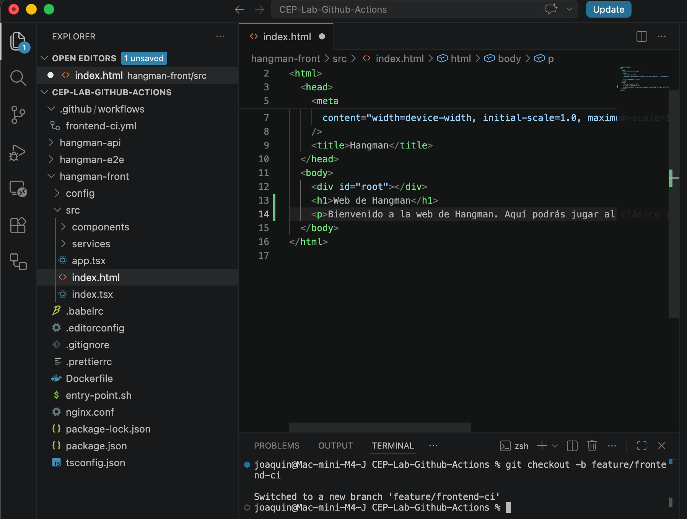

Hago commit y subo los cambios.
Ahora, si vuelvo a Github y miro la pestaña "Pull Request" para ver los resultados, veo que el workflow se ha ejecutado correctamente.

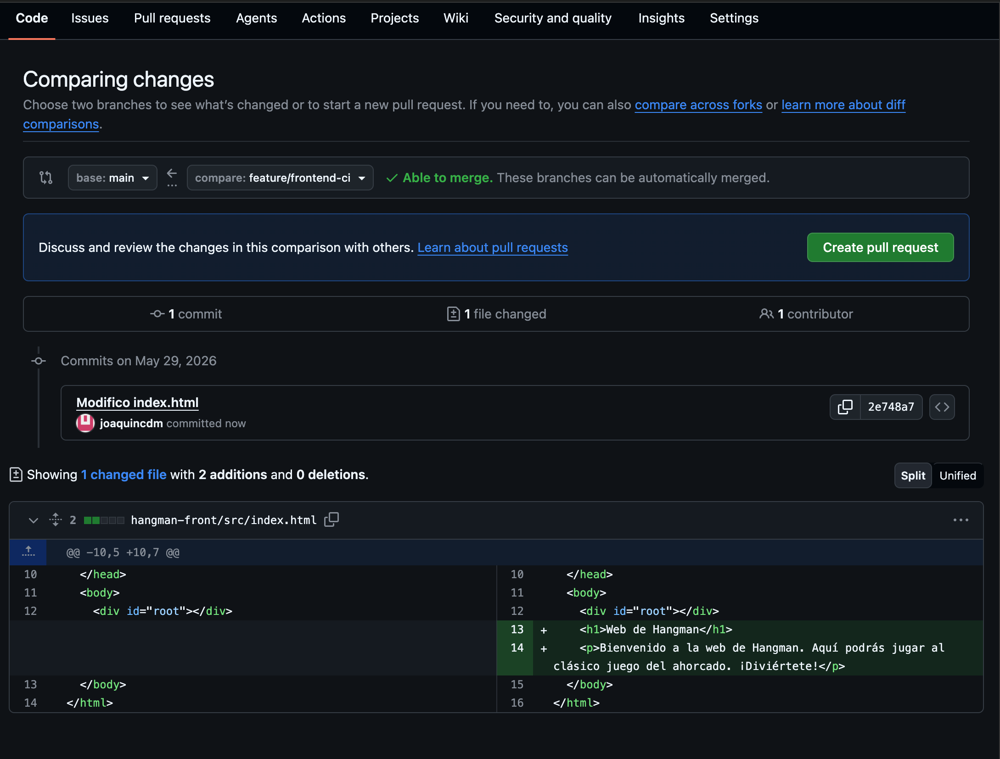

Al hacer el PR ahora sí se ejecuta el workflow, se ejecutan bien todos los pasos excepto los test unitarios que dan un error.

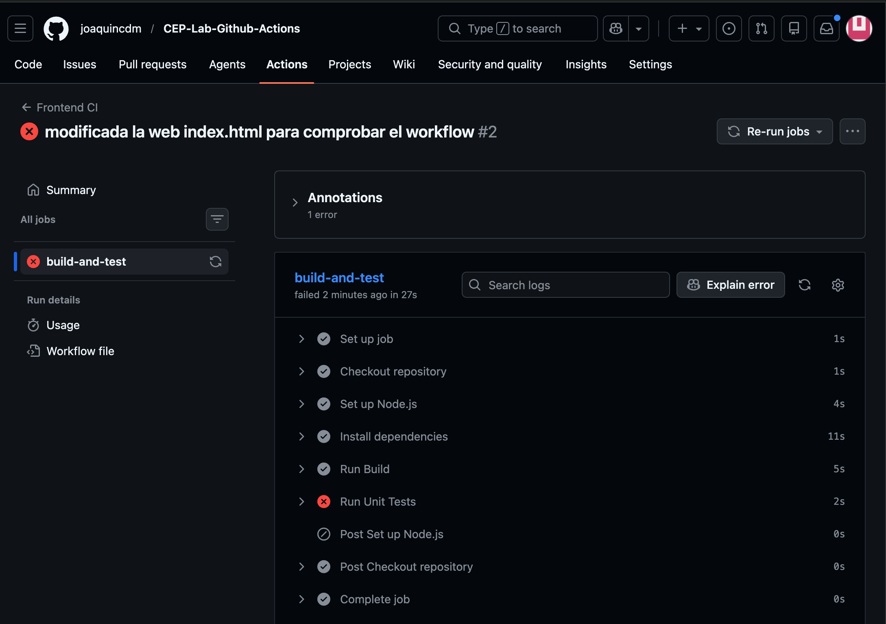

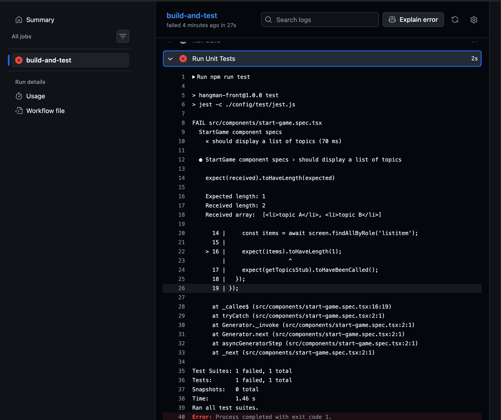

### Corrección del código (index.tsx)

Modifico el código del archivo index.tsx. Observo el error devuelto y el problema es que espera un array de 1 posición pero recibe uno de 2.

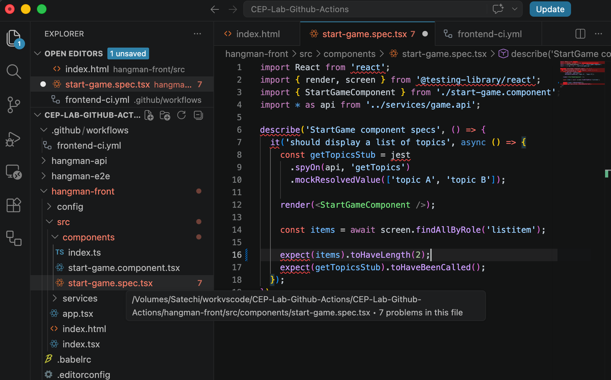

Al fin se ha ejecutado todo correctamente y sin errores.

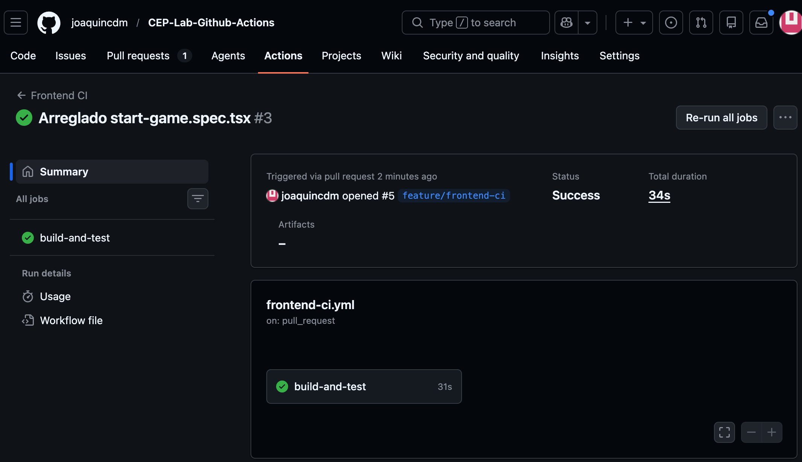

### Vuelvo a la rama main en local y actualizo trayendo los cambios de Github.

```bash
git checkout main
git pull origin main
```

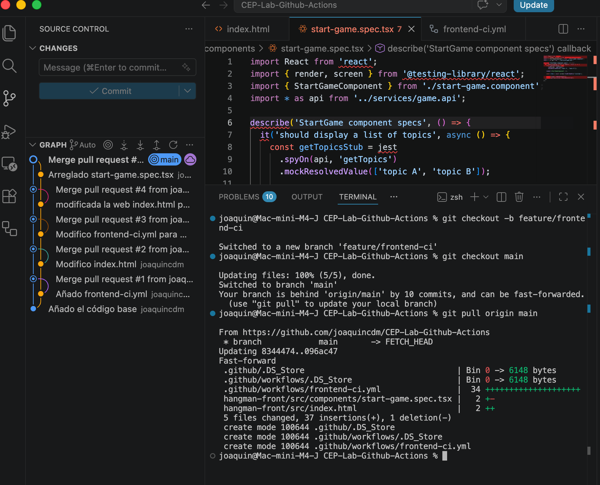

---

## 2. Workflow CD para el proyecto de frontend

Crea un nuevo workflow que se dispare manualmente y haga lo siguiente:

- Crear una nueva imagen de Docker
- Publicar dicha imagen en el [container registry de GitHub](https://docs.github.com/en/packages/working-with-a-github-packages-registry/working-with-the-container-registry)

> Nota: intenta usar las actions de Docker vistas en clase

En Github voy a Settings/Actions/General/Workflow permissions y marco la opción "Read and write permissions" para que pueda subir la imagen al contenedor registry.

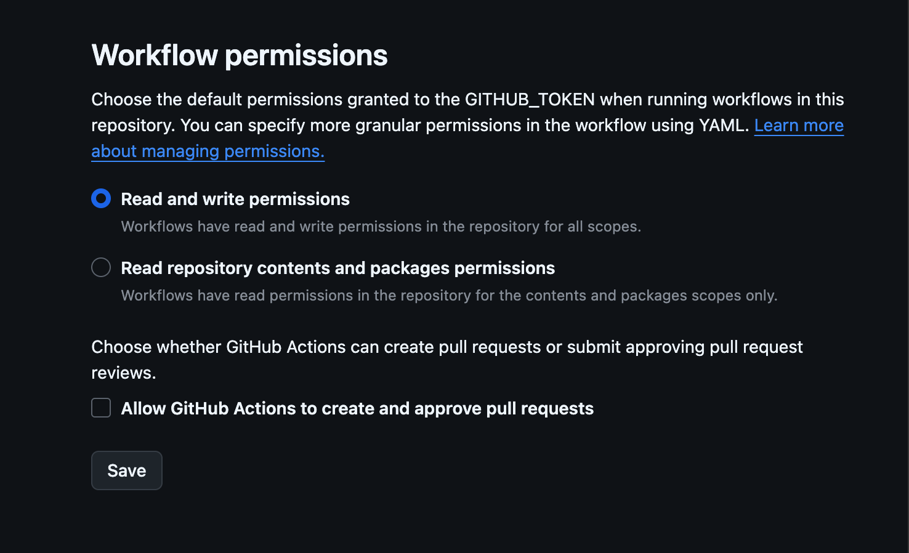

Cambio a una nueva rama y creo el archivo frontedn-cd.yml con el código del workflow.

```bash
git checkout -b feature/frontend-cd
```

Defino el workflow que esta vez no tiene eventos sino que se ejecuta manualmente.

```yaml
name: Frontend CD

on:
  workflow_dispatch:

permissions:
  contents: read
  packages: write

jobs:
  build-and-push:
    runs-on: ubuntu-latest

    steps:
      - name: Checkout repository
        uses: actions/checkout@v6

      - name: Lowercase repository owner
        id: prep
        run: echo "owner=${OWNER,,}" >> $GITHUB_OUTPUT
        env:
          OWNER: '${{ github.repository_owner }}'

      - name: Set up QEMU
        uses: docker/setup-qemu-action@v3

      - name: Set up Docker Buildx
        uses: docker/setup-buildx-action@v4

      - name: Log in to GitHub Container Registry
        uses: docker/login-action@v4
        with:
          registry: ghcr.io
          username: ${{ github.actor }}
          password: ${{ secrets.GITHUB_TOKEN }}

      - name: Build and push Docker image
        uses: docker/build-push-action@v6
        with:
          context: ./hangman-front
          file: ./hangman-front/Dockerfile
          push: true
          tags: ghcr.io/${{ steps.prep.outputs.owner }}/hangman-front:latest
```

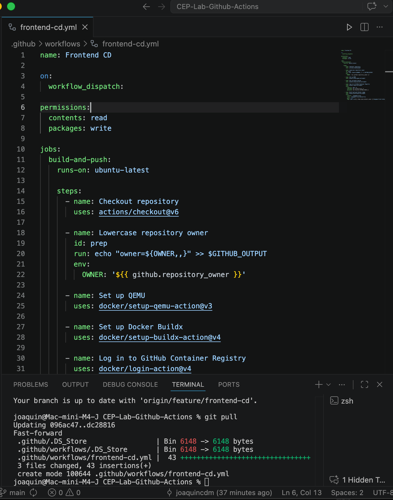

Subo los cambios a Github y voy a la pestaña "Actions", busco el workflow "Frontend CD" y lo ejecuto manualmente, pulsando "Run workflow".

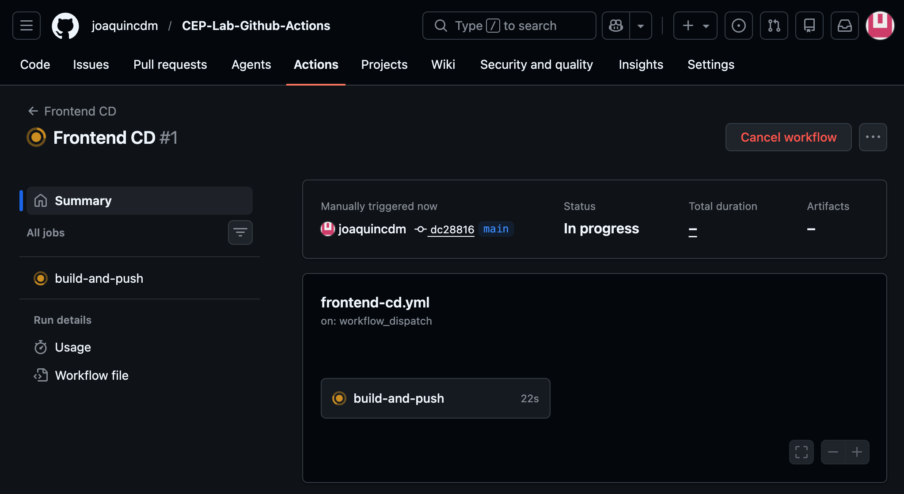

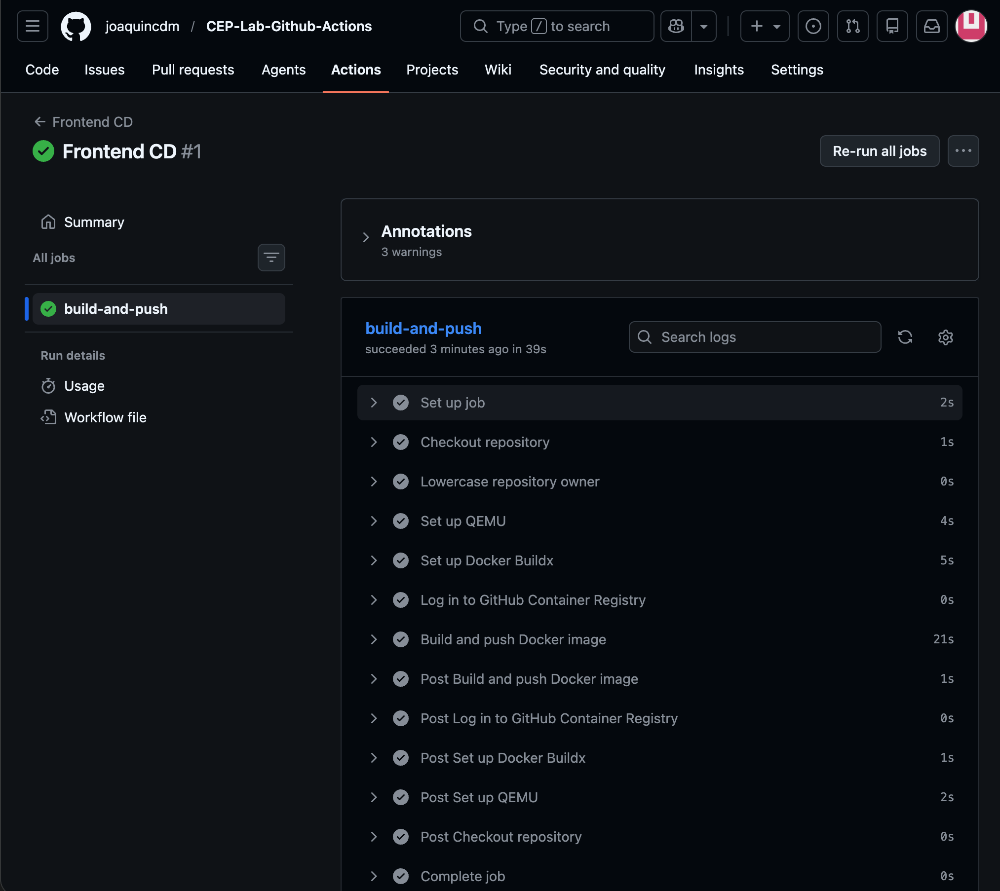

Y ahora si vuelvo a la pestaña "Packages" de Github puedo ver la imagen publicada.

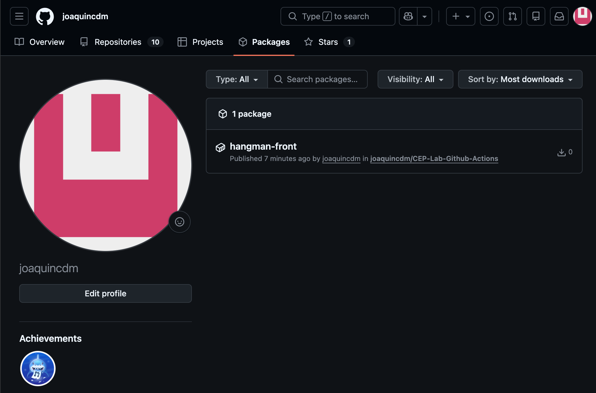


## 3. Workflow para ejecutar tests E2E (opcional)

Crea un workflow que se lance de la manera que elijas y ejecute los tests e2e que encontrarás en [este enlace](https://github.com/Lemoncode/bootcamp-devops-lemoncode/tree/master/03-cd/03-github-actions/.start-code/hangman-e2e/e2e). Puedes usar [Docker Compose](https://docs.docker.com/compose/gettingstarted/) o [Cypress action](https://github.com/cypress-io/github-action) para ejecutar los tests.
